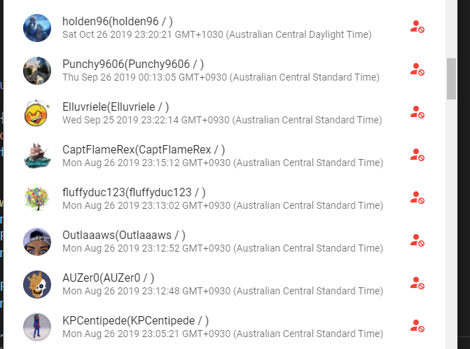

This is an abandoned script I wrote to solve 2 issues.

1. Manageing my xbox live friends list, in the attempt to fix a Sea of Thieves bug, where a friend leaderboard would not show due to an unknown error.
2. learning vue.js

Listing and viewing my friends in this manner, allowed me to see 

1. people I had followed that had not followed me back.
2. the dates that people had i had followed them, allowing me to make better decisions on who to remove to fix the issue / cleanup aged contacts.
3. people with strange characters / emoji's in their display names / real names.

I do not know what fixed the issue, but it's fixed after removing the 49 contacts in mini.jsondiff manually.

If I couldn't fix it by spot-checking removing friends, and intuition, I was going to plan on adding add/remove friend functionality, Luckily (for me) I didn't need to.

I would ask that you please respect the privacy of my friends, and do not use the data contained in an ill-manner.

